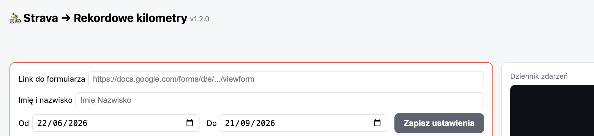
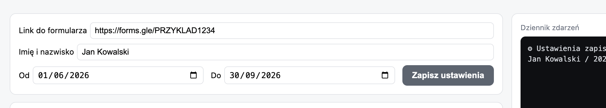
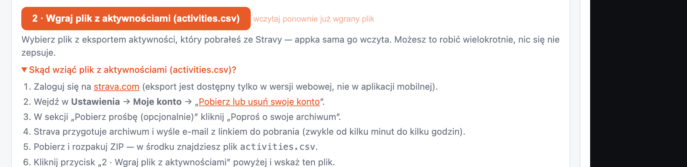
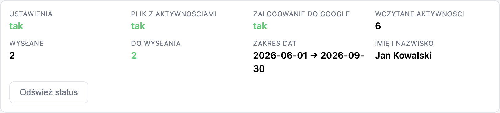
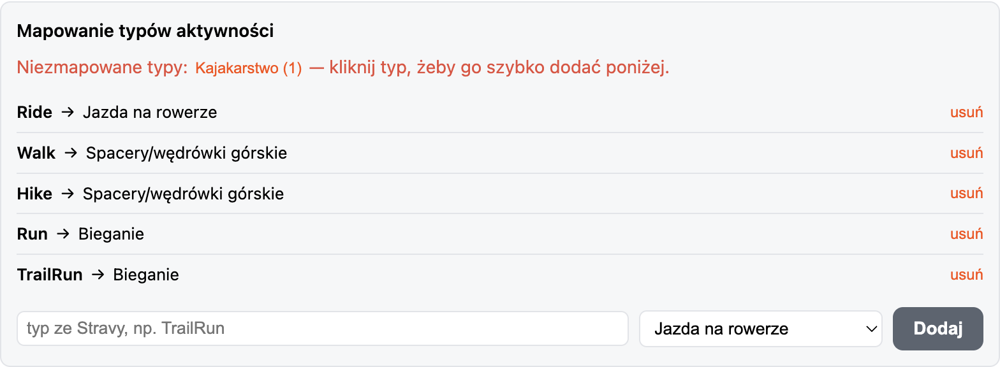
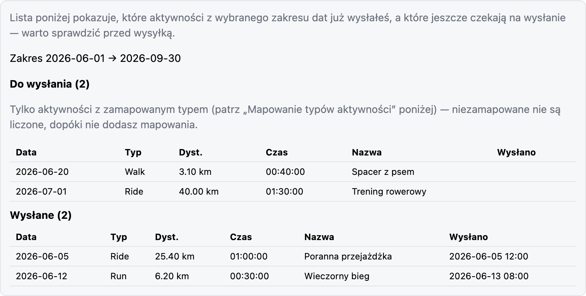
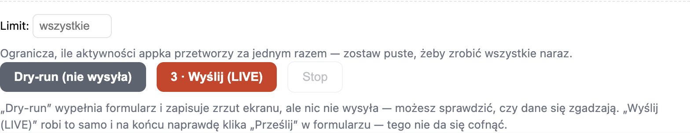
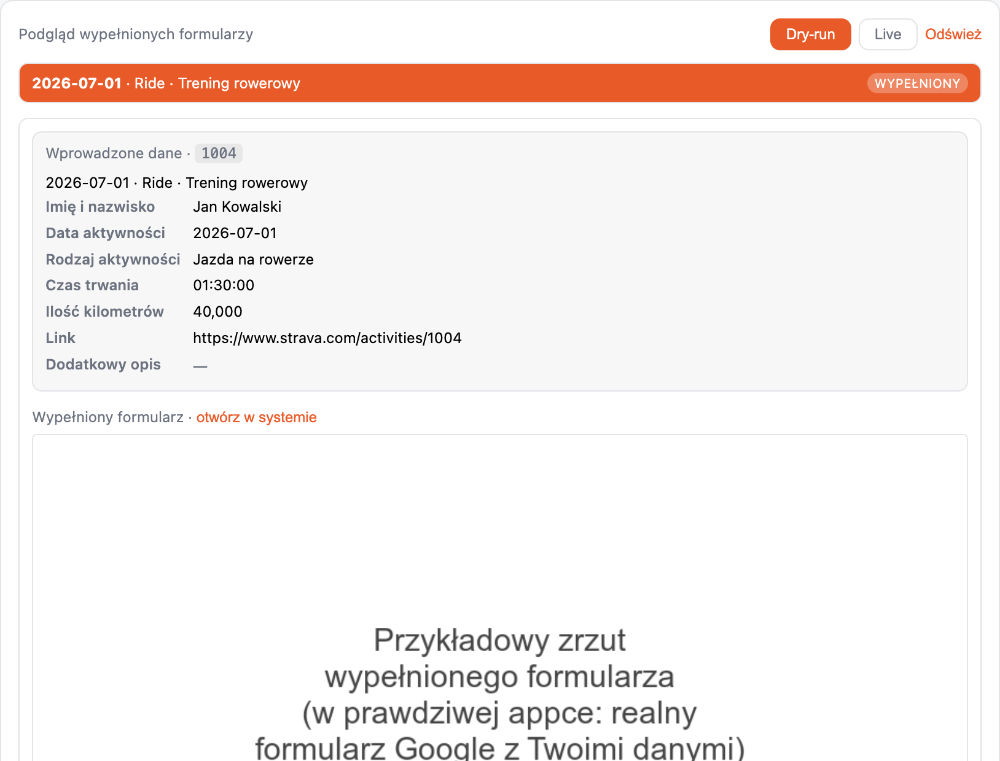
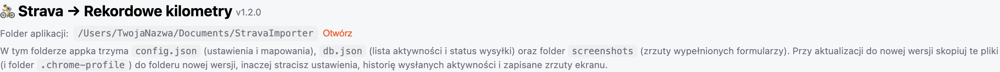

# Strava → Rekordowe kilometry — przewodnik

Ten dokument pokazuje krok po kroku, jak korzystać z aplikacji jako zwykły
użytkownik — bez wiedzy technicznej. (Jeśli chcesz zbudować appkę ze
źródeł albo interesuje Cię jak to działa pod spodem, zobacz
[`README.md`](README.md).)

> Zrzuty ekranu poniżej pokazują przykładowe, zmyślone dane (fikcyjny
> formularz, fikcyjne imię i aktywności) — Twoje własne dane w oknie appki
> będą inne.

## 1. Instalacja

### Windows

1. Pobierz plik `StravaImporter-*.zip`.
2. **Rozpakuj go do stałego folderu**, np. na Pulpit albo do Dokumentów —
   **nie zostawiaj** rozpakowanej appki w folderze Pobrane. Appka trzyma
   swoje ustawienia i bazę aktywności w tym samym folderze, w którym leży
   plik `.exe` — jeśli folder Pobrane zostanie kiedyś posprzątany, stracisz
   wszystko.
3. Wejdź do rozpakowanego folderu i uruchom `StravaImporter.exe` stamtąd.

### macOS

1. Otwórz plik `StravaImporter-*.dmg`.
2. Przeciągnij `StravaImporter.app` do wybranego folderu (np. Aplikacje albo
   Dokumenty).
3. Przy **pierwszym** uruchomieniu zwykłe podwójne kliknięcie nie zadziała —
   macOS pokaże „nie można otworzyć, bo pochodzi od niezidentyfikowanego
   dewelopera”. Kliknij prawym przyciskiem na appkę → **Otwórz** → potwierdź.
   Kolejne uruchomienia działają już normalnie, zwykłym kliknięciem.

### Linux

1. Pobierz plik `StravaImporter-*.AppImage`.
2. Nadaj mu uprawnienia do uruchamiania: `chmod +x StravaImporter-*.AppImage`.
3. Uruchom go dwuklikiem albo z terminala.

## 2. Pierwsze uruchomienie

Przy pierwszym starcie appka sama tworzy sobie plik ustawień — zobaczysz
puste pola i czerwoną ramkę wokół panelu **Ustawienia**, przypominającą co
trzeba uzupełnić.

## 3. Uzupełnij Ustawienia

Wpisz:
- **Link do formularza** — adres Twojego formularza Google, do którego
  zgłaszasz aktywności.
- **Imię i nazwisko** — dokładnie tak, jak ma się pojawić w zgłoszeniach.
- **Zakres dat** — od kiedy do kiedy appka ma zgłaszać aktywności (np. czas
  trwania wyzwania).

Kliknij **Zapisz ustawienia**.

## 4. Zaloguj się do Google

Kliknij **„1 · Zaloguj do Google”** — otworzy się Twoja normalna przeglądarka
Chrome. Zaloguj się tam na konto Google, którym wypełniasz formularz (2FA
działa normalnie). Okno zamknie się samo, gdy formularz będzie widoczny —
to jednorazowe, appka zapamiętuje sesję na przyszłość.

Jeśli musisz się przelogować na inne konto Google, użyj przycisku
**„Wyloguj się”** obok.

## 5. Wgraj plik z aktywnościami (`activities.csv`)

Kliknij **„2 · Wgraj plik z aktywnościami (activities.csv)”** — appka sama
sprawdzi, skopiuje i wczyta wskazany plik. Jeśli nie wiesz, skąd wziąć taki
plik, rozwiń pomoc pod przyciskiem:

Po wgraniu import jest automatyczny — na górze zobaczysz zaktualizowany
status:

## 6. Sprawdź mapowanie typów aktywności

Pytanie „Rodzaj aktywności” w formularzu ma z góry ustalone opcje (np. „Jazda
na rowerze”, „Bieganie”) — appka musi wiedzieć, który typ ze Stravy (np.
`Ride`, `TrailRun`) odpowiada której opcji. Zwykle nic nie trzeba robić —
przy pierwszym imporcie appka sama dopasowuje najczęstsze typy. Jeśli jednak
masz w swoich aktywnościach coś rzadszego (np. kajakarstwo, wspinaczkę),
zobaczysz to jako **niezmapowany typ** z licznikiem — kliknij go, żeby
wypełnić pole poniżej, wybierz pasującą opcję formularza z listy i kliknij
**Dodaj**.

Aktywności bez mapowania **nie liczą się** do wysłania, dopóki nie dodasz dla
nich mapowania.

## 7. Sprawdź listę do wysłania

Pod krokiem importu appka od razu pokazuje, co z wybranego zakresu dat jest
już wysłane, a co jeszcze czeka:

## 8. Dry-run (wypróbuj bez wysyłania)

Zanim wyślesz cokolwiek naprawdę, warto zrobić **Dry-run** — appka wypełnia
formularz i zapisuje zrzut ekranu, ale **niczego nie wysyła**. To najlepszy
sposób, żeby sprawdzić, czy dane się zgadzają.

Pole **Limit** pozwala ograniczyć, ile aktywności appka przetworzy za jednym
razem (puste = wszystkie).

## 9. Wyślij naprawdę

Gdy dry-run wygląda dobrze, kliknij **„3 · Wyślij (LIVE)”**. Appka zrobi
dokładnie to samo, co przy dry-run, ale na końcu **naprawdę** kliknie
„Prześlij” w formularzu.

> **Tego nie da się cofnąć.** Każda wysłana aktywność zostaje oznaczona jako
> wysłana i nie zostanie wysłana ponownie przy kolejnych uruchomieniach —
> chyba że ręcznie zmienisz jej status.

Przycisk **Stop** przerywa wysyłkę po zakończeniu bieżącej aktywności.

## 10. Podgląd zrzutów ekranu

Panel **„Podgląd wypełnionych formularzy”** pozwala przejrzeć, co dokładnie
zostało wpisane w formularzu dla każdej aktywności (osobno dla dry-run i
wysyłki na żywo) — przydatne do sprawdzenia, czy coś nie poszło nie tak.

## 11. Aktualizacja do nowej wersji

Appka trzyma wszystkie swoje dane (ustawienia, bazę aktywności, zrzuty
ekranu, zapisaną sesję logowania) w **folderze aplikacji** — tym samym, w
którym leży plik wykonywalny. Przycisk **„Otwórz”** obok „Folder aplikacji”
otwiera ten folder.

Instalując nową wersję appki, **skopiuj** z folderu starej wersji do folderu
nowej:
- `config.json` (ustawienia i mapowania),
- `db.json` (lista aktywności i status wysyłki),
- folder `screenshots/` (zapisane zrzuty),
- folder `.chrome-profile/` (zapamiętane logowanie do Google).

Bez tego kroku stracisz historię wysłanych aktywności i będziesz musiał
zalogować się do Google ponownie.
